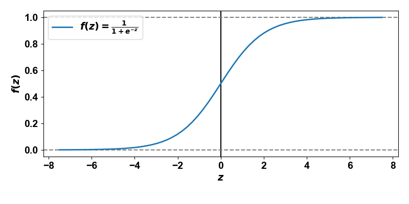
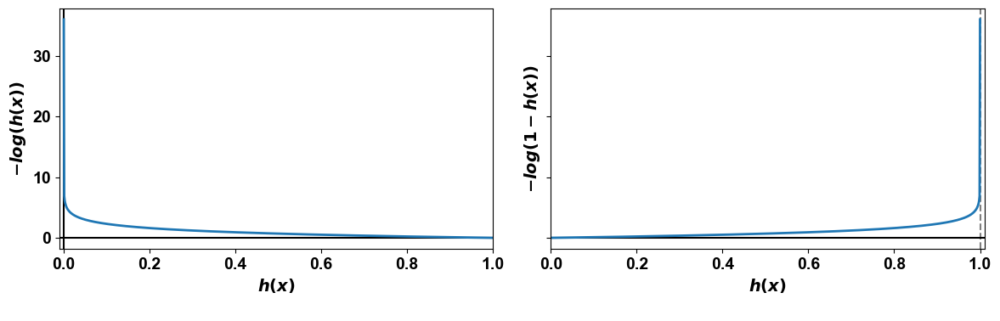

# Classification task
Classification is a supervised machine learning method where the model tries to predict the correct label of a given input data. The model is trained using the training data, and then it is evaluated on test data, before being used to perform prediction on new unseen data.

We'll deal with the classification task, implementing its simplest form known as binary classification which returns two discrete classes:
- 1 ("yes") the positive class
- 0 ("not") the negative class or.

A technique for solving a binary classification task is logistic regression.

&nbsp;

## Logistic regression
Logistic regression provides a probabilistic framework for understanding and predicting binary outcomes. It computes a weighted sum of the input features (as the linear regression does) and estimates the probability that outcome belongs to a specific class (instead of returning a continuous value).

$$h(x) = f(\theta_0 + \theta_1x_1 + \theta_2x_2 + \dotsc + \theta_nx_n)$$

where
- $h(x)$ is the hypothesis function
- $x_1, x_2, \dotsc, x_n$ are the independent variables (predictors)
- weights $\theta_0, \theta_1, \theta_2, \dotsc, \theta_n$ are the parameters (or weights) of the model
- $n$ is the number of features

its vectorized form is defined as follow:

$$h(\textbf{x}) = f(\theta^T \textbf{x})$$

$f(\cdot)$ is the logistic function that activates the hypothesis function to outcome in a number between 0 and 1 and defined as follow:

$$f(z) := \frac{1}{1+e^{-z}}$$

 Fig. 1 - Sigmoid function graph

&nbsp;

The logistic function is a sigmoid form that takes the value 0.5 as the threshold value when z = 0 to outcome its predictions. In part. with positive input, the function will produce a probability greater than 0.5 (i.e. predicting it as the positive class) whereas with negative input the negative class will be predicted.

$$\hat{y} =
  \begin{cases}
    1       & \quad \text{if } h(\textbf{x}) \geq 0.5\\
    0       & \quad \text{otherwise } 
  \end{cases}$$

Then we need to evaluate the performance of the model before applying gradient descent method to optimize the parameters of it. Let's bound to loss function.

&nbsp;

## Loss function
The loss function for a logistic regression model is defined as follow:

$$l({\theta}) =
  \begin{cases}
    -\text{log}(h(\textbf{x}))       & \quad \text{if} \ y = 1\\
    -\text{log}(1-h(\textbf{x}))     & \quad \text{if} \ y = 0 
  \end{cases}$$

We try to understanding why these functions are chosen.  

 Fig. 2 - Cost function graph for a single training input

&nbsp;

If the input belongs to the positive class ($-\text{log}(h(\textbf{x}))$ graph), as the forecast comes close to 0 (we make a wrong prediction), the loss function goes to infinity. Similarly, if the inputt belongs to the negative class ($-\text{log}(1-h(\textbf{x}))$ graph), as the forecast comes close to the positive it (wrong prediction), the model will be punished (infinitive cost).

We determine the loss function for the model that can be expressed in a following formula:

$$L(\theta) = -\frac{1}{m} \sum_{i=1}^m [y^{(i)}\text{ log}(h(x^{(i)})) + (1-y^{(i)}) \text{ log}(1-h(x^{(i)}))]$$

where
- $\theta$ are the inputs of the loss function
- $m$ is the number if instances
- $x^{(i)}$ is the input (features) of i-th training example
- $y^{(i)}$ is the output (features) of i-th training example

The meaning of this equation is to compute the average cost over all the training sets; the adding of the terms $y^{(i)}$ and $(1-y^{(i)})$ guarantees to use of the formula based on the original output. The model is good if and only if its loss function is small. 
Our goal is to determine the model’s parameter vector to minimize the loss function by using the gradient descent algorithm.

&nbsp;

## Gradient descent algorithm in logistic regression model
The algorithm will update the theta values after each iteration and the model will fits to try to find the global minimum of the loss function. In particular the gradient descent algorithm updates the model theta values iteratively by moving in the direction opposite to the gradient of the loss function. So, with each step of gradient descent, the theta values come closer to the optimal values that will achieve the lowest loss.

$$\text{repeat until convergence}$$ $$\theta_j := \theta_j - \alpha \frac{\partial}{\partial{\theta_j}} L(\theta_1, \theta_2, \dotsc \theta_n)$$ $$\text{simultaneously update } \theta_j$$ $$\forall j = 0, 1, \dotsc, n$$

$\alpha$ is the _learning rate_ (or step size) of the algorithm (i.e. controls the rate at which the model learns). Choosing an opportune learning rate is important as it will ensure the loss function will converge in a reasonable time: if the model is failed to converge ($\alpha$ too large) or if it takes too much time to find its minimum ($\alpha$ too small), implies that our learning rate is probably a inappropriate choice.

After taking partially differentiate of the loss function the algorithm becomes:

$$\text{repeat until convergence}$$ $$\theta_j := \theta_j - \frac{1}{m} \sum_{i=1}^m [f(\theta^T x^{(i)})-y^{(i)}]x_j^{(i)}$$ $$\text{simultaneously update } \theta_j$$ $$\forall j = 0, 1, \dotsc, n$$

where $x_j^{(i)}$ is the value of feature _j_ in i-th training example.

Instead of calculating each single theta, we can generate the gradient vector to compute them in just one step. The formula of gradient vector for the loss function is defined as follow:

$$\nabla_\theta L(\theta) = 
    \begin{bmatrix}
        \frac{\partial}{\partial{\theta_0}} L(\theta_0) \\
        \frac{\partial}{\partial{\theta_1}} L(\theta_1) \\
        \frac{\partial}{\partial{\theta_2}} L(\theta_2) \\
        \vdots \\
        \frac{\partial}{\partial{\theta_n}} L(\theta_n)
    \end{bmatrix} = 
    \frac{1}{m} \textbf{X}^T (f(\textbf{X}\theta) - y)
$$

where $\textbf{X}$ is the matrix containing all the values in the dataset (exclude the values of the outcomes) 

$$\textbf{X} = 
    \begin{bmatrix}
        (x^{(0)})^T \\
        (x^{(1)})^T \\
        (x^{(2)})^T \\
        \vdots \\
        (x^{(n)})^T
    \end{bmatrix}$$

Lastly, the updated theta values, utilizing the gradient descent algorithm, are defined by following formula:

$$\theta_{\text{updated}} = \theta - \alpha \nabla_\theta L(\theta)$$
